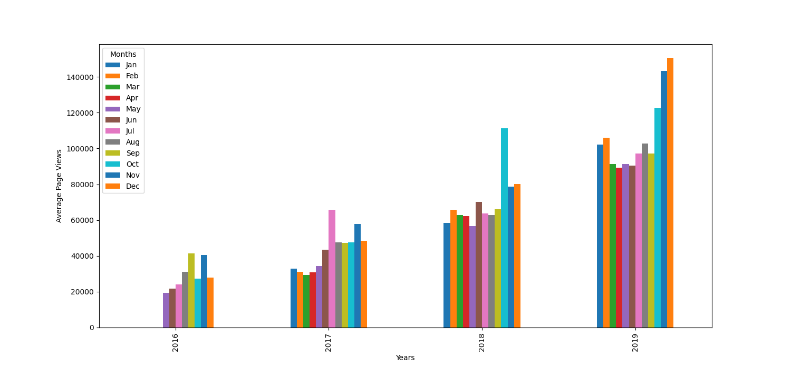

# Page View Time Series Visualizer

This project is part of the freeCodeCamp **Data Analysis with Python** certification.

## Description
The project analyzes daily forum page view data and visualizes trends over time using Python.

## Visualizations
The following plots are created in this project:

### Line Plot
Shows daily page views over time to identify overall trends.

### Bar Plot
Shows average monthly page views grouped by year.

### Box Plot
Shows the distribution of page views by year and by month to identify outliers and seasonality.

## Technologies Used
- Python
- Pandas
- Matplotlib
- Seaborn

## Dataset
The dataset used is `fcc-forum-pageviews.csv` provided by freeCodeCamp.
